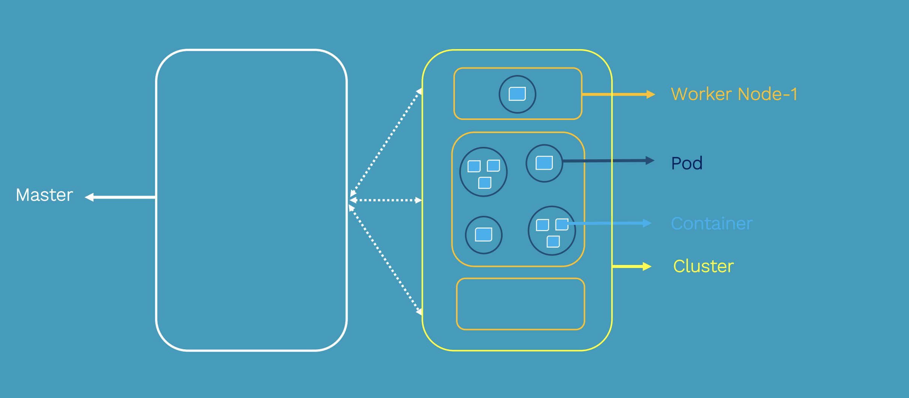
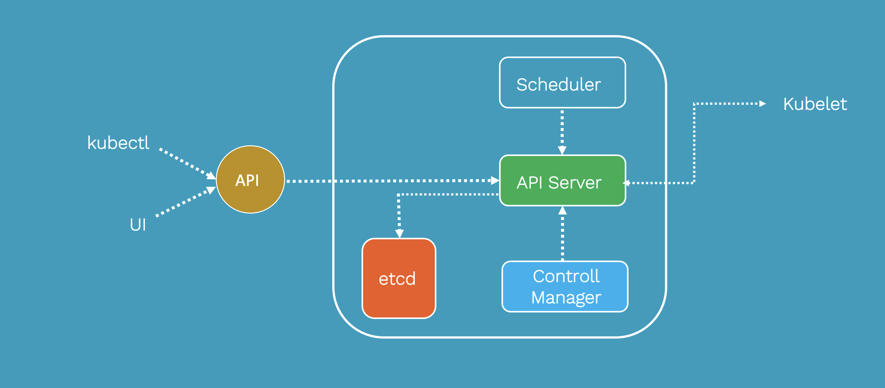
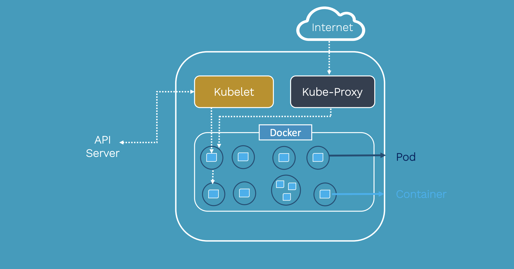
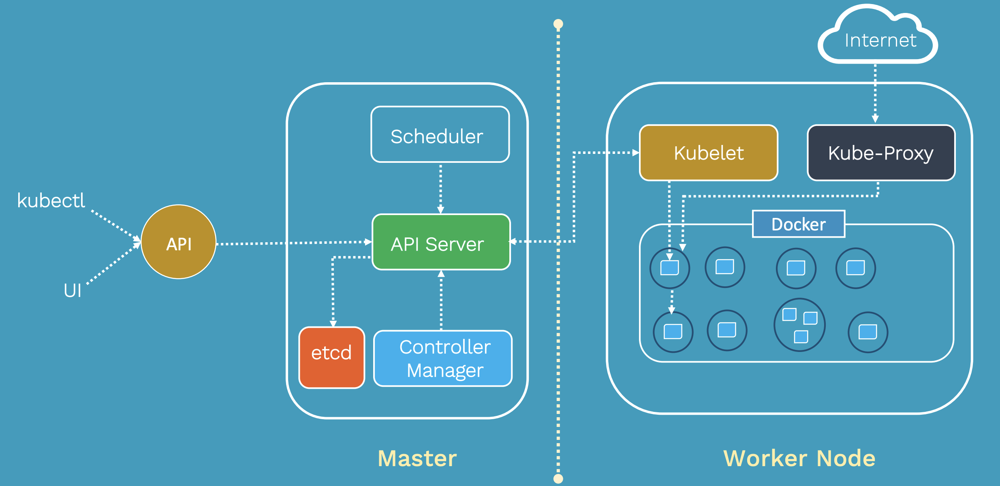

# Kubernetes Learning 

 - Learning Kubernetes
 - Exploring Archiecture
 - Kubernetes Installtion and Setup
 - Exploring Kubernetes Components like pods, deployment, services, replica set ...

# Overview

Kubernetes is an open-source container-orchestration system for automating application deployment, scaling, and management. It was originally designed by Google, and is now maintained by the Cloud Native Computing Foundation
It groups containers that make up an application into logical units for easy management and discovery. Kubernetes builds upon 15 years of experience of running production workloads at Google, combined with best-of-breed ideas and practices from the community.
#### Service discovery and load balancing
No need to modify your application to use an unfamiliar service discovery mechanism. Kubernetes gives Pods their own IP addresses and a single DNS name for a set of Pods, and can load-balance across them.
####  Automatic bin packing
Automatically places containers based on their resource requirements and other constraints, while not sacrificing availability. Mix critical and best-effort workloads in order to drive up utilization and save even more resources.
####  Storage orchestration
Automatically mount the storage system of your choice, whether from local storage, a public cloud provider such as GCP or AWS, or a network storage system such as NFS, iSCSI, Gluster, Ceph, Cinder, or Flocker.
####  Self-healing
Restarts containers that fail, replaces and reschedules containers when nodes die, kills containers that don’t respond to your user-defined health check, and doesn’t advertise them to clients until they are ready to serve.
####  Automated rollouts and rollbacks
Kubernetes progressively rolls out changes to your application or its configuration, while monitoring application health to ensure it doesn’t kill all your instances at the same time. If something goes wrong, Kubernetes will rollback the change for you. Take advantage of a growing ecosystem of deployment solutions.
####  Secret and configuration management
Deploy and update secrets and application configuration without rebuilding your image and without exposing secrets in your stack configuration.
####  Batch execution
In addition to services, Kubernetes can manage your batch and CI workloads, replacing containers that fail, if desired.
####  Horizontal scaling
Scale your application up and down with a simple command, with a UI, or automatically based on CPU usage.

## Kubernetes Architecture






## Installtion and Setup

 - Installtion using MiniKube [MiniKube]('./MiniKube.txt')
 - Installation using kubeadm  [kubeadm]('./Kubeadm.txt')

## Creating a simple Pod 

```
kind: Pod
apiVersion: v1
metadata:
  name: marks-dummy-pod
spec:
  containers:
    - name: marks-dummy-pod
      image: ubuntu
      command: ["/bin/bash", "-ec", "while :; do echo '.'; sleep 5 ; done"]
  restartPolicy: Never
```

```
apiVersion: v1
kind: Pod
metadata:
  name: nginx-pod
  labels:
    app: nginx
    tier: dev
spec:
  containers:
  - name: nginx-container
    image: nginx
 ```   

 ### create and deploy Pods

 ```
 kubectl create -f nginx-pod.yaml
kubectl get pod
kubectl get pod -o wide
kubectl get pod nginx-pod -o yaml
kubectl describe pod nginx-pod
 ```

### Refernce 

 - Srinath Challa https://www.youtube.com/user/srinathrchalla1
 

### workshop examples coming soon...


